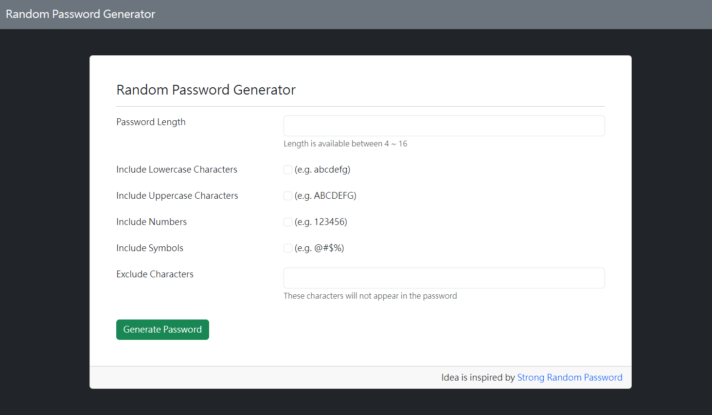
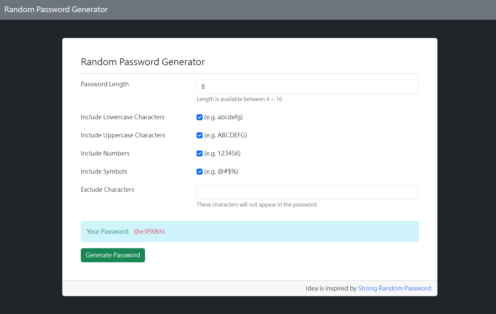

# 密碼產生器

隨機產生指定長度與字元集的密碼




## 功能

- 依照指定的長度及選取的字元集來產生隨機密碼
- 可排除不想要包含在密碼中的字元

## 開始使用

1. 將專案 clone 到本地

2. 移動到專案資料夾

   ```
   cd password-generator
   ```

3. 輸入以下指令安裝相依套件

   ```
   npm install
   ```

4. 啟動應用程式

   ```
   npm run start
   ```

5. 打開瀏覽器並進入以下網址

   ```
   http://localhost:3000
   ```

6. 結束應用程式

   ```
   crtl + c
   ```

## 開發工具

- Node.js v18.15.0
- Express.js v4.18.2
- Express-Handlebars v7.0.7
- Bootstrap v5.3.1
